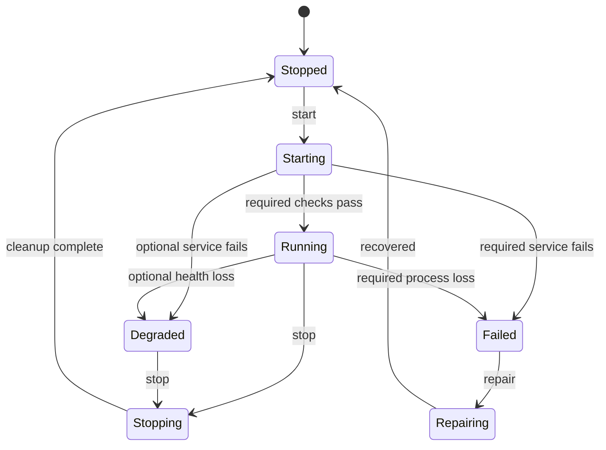

# Architecture

## Product boundary

Orynquix Stage 1 is a graphical phone interface and control plane over existing, independently maintained Android and Linux components. Android retains its kernel, drivers, security model and application environment. Termux provides the no-root host userspace. `proot-distro` provides a persistent Debian ARM64 filesystem. Termux:X11 provides display transport. XFCE is the temporary dependable desktop base.

The original adaptive Pocket, Tablet and Desk shell is deliberately outside the Stage 1 critical path.

## Components

### Phone GUI

The primary interface is an adaptive HTML/CSS/JavaScript application served by Python's standard library on `127.0.0.1`. It has no cloud backend and no non-loopback bind option. A persistent owner-only random token authorizes the Android browser; the launch URL exchanges it for a strict local cookie and immediately removes it from the visible address.

The GUI never assembles shell commands. It calls typed bootstrap, probe, lifecycle, repair and proof objects in background jobs. Only one mutating GUI job may run at a time, and the existing operation lock remains the final cross-process guard. Host validation, same-origin checks, JSON-only mutation requests, a request marker and a restrictive content security policy reduce browser-origin attacks.

### Host probe

The probe is read-only. It records architecture, Android version, Termux presence, Python version, memory, free storage, runtime commands and the Termux:X11 companion state. Human and JSON formats contain the same facts. Missing installable runtime packages are warnings during pre-bootstrap inspection and hard failures for `doctor --runtime` and `start`.

### Bootstrap manager

Bootstrap steps are declarative, independently checked and journaled. Every run checks current state before acting. The Debian ownership flag is written only after Orynquix successfully creates a previously absent rootfs. An interrupted install remains resumable; Orynquix never solves uncertainty by deleting a filesystem.

### Lifecycle manager

Start order:

1. acquire the single-writer lock;
2. validate runtime prerequisites and configuration;
3. write `starting` state atomically;
4. start Termux:X11 and wait for its real Unix socket;
5. start or verify optional PulseAudio;
6. start the Debian XFCE session;
7. require the process to remain stable before reporting `running` or `degraded`.

Stop order is the reverse for project-owned processes. PulseAudio is not forcibly killed because a pre-existing instance may serve other Termux programs. Orynquix starts it with an idle exit policy instead.

Every child record contains PID, process group, Linux process-start ticks and a SHA-256 digest of the actual `/proc/<pid>/cmdline`. Stop and repair send a signal only when all identity fields still match, preventing harm from PID reuse.

### State and recovery

- TOML contains user-controlled configuration.
- JSON contains current machine state and bootstrap ownership metadata.
- JSON Lines is the append-only recovery journal.
- Atomic temp-file replacement protects JSON/TOML from partial writes.
- An advisory lock prevents concurrent bootstrap/lifecycle/uninstall mutation.
- Invalid session JSON is archived, never silently overwritten, during confirmed repair.

### Trust boundaries

- `proot` is not a VM or sandbox.
- Stage 1 starts no non-loopback listener. Optional PulseAudio transport is restricted to `127.0.0.1`.
- No telemetry is implemented.
- Subprocesses use argument arrays; no user value is interpolated into shell code.
- A configured Android folder is validated and bound as exactly one guest path.
- Recursive deletion accepts only four exact Orynquix-controlled roots and explicitly protects `/`, the user home and the projects directory.
- Support bundles redact likely credentials and home paths, then require the owner to review the archive before sharing.

## State model

## Future boundaries

Stage 2 may add a reliable-core profile and more measured device support. Developer tool profiles belong to Stage 3. The custom adaptive shell belongs to Stage 4 and remains replaceable until it passes lifecycle, accessibility, touch, keyboard, pointer and recovery acceptance tests.
