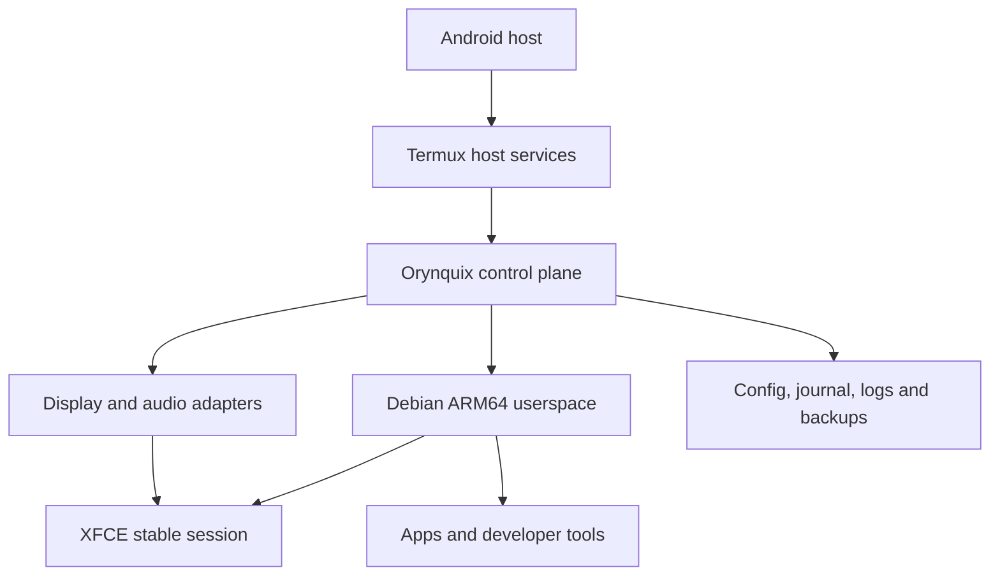
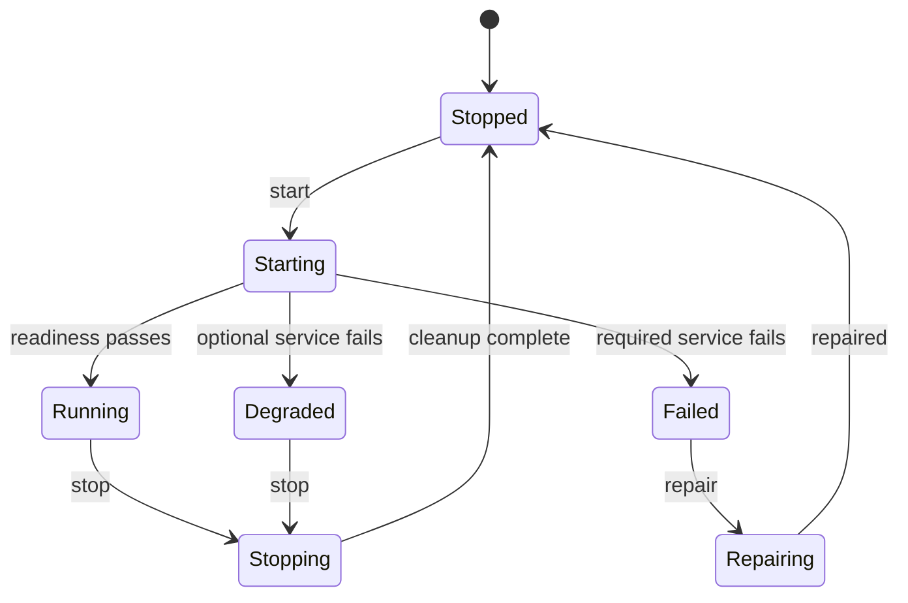

# Orynquix Pre-Build Engineering Brief

**Project owner:** ItsYashXX  
**Target repository:** `https://github.com/itsyashxx/orynquix`  
**Document status:** Pre-implementation proposal  
**Scope:** Required outputs before Stage 1 implementation  
**Prepared:** 2 September 2026

> No operating-system code is implemented by this document. It defines what Orynquix should build first, what is technically possible, how success will be measured, and which decisions require owner approval.

## 1. Concise Interpretation of the Vision

Orynquix should begin as a reliable, no-root Linux computing environment that runs alongside Android through Termux, a supported Linux userspace, and Termux:X11. Its first job is not to imitate Windows or claim universal application support. Its first job is to make an Android phone genuinely useful as a portable graphical coding and productivity workstation.

The product should combine three experiences:

- **Pocket Mode:** a touch-first workspace for the phone screen;
- **Desk Mode:** a pointer-and-keyboard desktop for tablets and external monitors;
- **Remote Mode:** secure access to stronger computers for software that cannot run locally.

Orynquix must present one coherent product layer above the underlying tools: an installer, lifecycle manager, diagnostics, app compatibility information, backups, recovery, and eventually an original adaptive shell. The first releases should use a proven lightweight desktop foundation while the custom shell is prototyped and tested independently.

The core product promise is therefore:

> Carry a persistent, honest, repairable Linux workstation in an Android phone, with the best available path for each application: native, Android-integrated, web, translated experimentally, remote, or unsupported.

## 2. Feasibility Matrix

| Capability | Path | Mobile Community Edition | Stage | Important constraint |
| --- | --- | --- | --- | --- |
| Linux ARM64 command-line tools | Native | High feasibility | Stage 1–3 | Package availability differs between Termux and the guest distribution. |
| Linux ARM64 graphical apps | Native through X11 | High for tested apps | Stage 1–3 | GPU acceleration, audio, DBus and sandbox behavior vary by device. |
| XFCE desktop session | Native through X11 | High | Stage 1–2 | Must be tuned for touch, RAM use and clean shutdown. |
| Custom Orynquix shell | Native first-party UI | Feasible, significant work | Stage 4 | Should not block the first reliable release. |
| code-server | Native/web hybrid | High | Stage 3 | Bind to localhost by default and require deliberate network exposure. |
| Git, Python, Node.js, Java, C/C++, Rust and Go | Native | High | Stage 2–3 | Heavy compilers and builds need storage, thermal and memory warnings. |
| Chromium/Firefox | Native when repository supports ARM64 | Medium–high | Stage 3 | Performance and sandbox limitations must be tested per distribution. |
| Android application launch | Integrated Android | Medium | Stage 4–5 | Apps remain Android apps outside the Linux userspace. |
| Web/PWA apps | Web/PWA | High | Stage 3–5 | Offline capability depends on the application. |
| Local Linux x86_64 apps on ARM64 | Translated — Experimental | Low–medium per app | Stage 5+ | Never enable globally or imply compatibility without per-app tests. |
| Local Windows apps | Wine/translation — Experimental | Low per app | Stage 5+ | Architecture, graphics, DRM and anti-cheat often prevent operation. |
| Docker daemon in unrooted proot | Unsupported locally | Not a supported target | — | Offer a remote container host or later desktop edition. |
| Kernel modules, KVM and privileged containers | Unsupported locally | Not possible in the main edition | — | Requires a rooted/VM/desktop environment outside the primary scope. |
| macOS/iOS-only binaries | Remote or official web version | Not possible locally | Stage 5+ | Do not emulate or imply local support. |
| GPU-heavy professional software | Native only after proof; otherwise remote | Device-dependent | Stage 5+ | Driver and acceleration support cannot be assumed. |
| Full Android replacement or custom ROM behavior | Impossible in no-root edition | Out of scope | — | Orynquix runs alongside Android and does not replace its kernel or firmware. |
| Bootable x86_64 desktop operating system | Native desktop edition | Feasible as a separate later product | Stage 7 | Requires ISO, installer, hardware, upgrade and VM testing programs. |

### Compatibility policy

Every application entry must have exactly one user-visible primary badge: **Native**, **Integrated Android**, **Web/PWA**, **Translated — Experimental**, **Remote**, or **Unsupported**. A badge is evidence-based, device-aware, and tied to a tested install and launch procedure. “Install” must never appear when only documentation or an unverified idea exists.

## 3. Proposed Technology Stack

### Recommended foundation

| Layer | Primary choice | Reason | Alternative or fallback |
| --- | --- | --- | --- |
| Android host | Supported Termux build | Mature no-root terminal and package environment | None for the primary edition |
| Guest userspace | Debian stable ARM64 through `proot-distro` | Conservative packages, broad ARM64 availability, predictable upgrades | Ubuntu LTS after an explicit compatibility comparison |
| Display | Termux:X11 | Lower latency and better desktop interaction than typical VNC paths | TigerVNC-compatible fallback with explicit limitations |
| Initial desktop | XFCE 4 | Lightweight, mature, scriptable and suitable for the reliable-core phase | LXQt if measured performance or touch behavior is materially better |
| Audio | Current supported Termux audio path, detected at runtime | Avoids hard-coding assumptions about one Android release | Audio disabled with a clear diagnostic state |
| Control CLI | Python 3.12+ with `argparse`, dataclasses and typed domain models | Available, approachable for contributors, fast iteration, strong testing ecosystem | Rust after requirements stabilize and profiling proves a need |
| Configuration | TOML for user config; JSON for machine state | Human-readable configuration and interoperable state | YAML only if a justified schema workflow is adopted |
| Schemas | JSON Schema | Language-neutral validation for manifests and feature data | Pydantic models generated or kept aligned with schemas |
| Host commands | Typed Python adapters using subprocess argument arrays | Testable and safer than shell-string construction | Small reviewed POSIX shell only for initial bootstrap |
| State and journals | SQLite plus append-only structured logs | Transactions, migrations and recovery without a server | JSON Lines for early proof telemetry only |
| App catalog | Declarative YAML or JSON manifests validated by schema | Reviewable, diffable and incapable of hiding arbitrary GUI-executed shell fragments | TOML manifests if maintainers prefer one syntax |
| First-party GUI | GTK4/PyGObject for early utilities, evaluated by prototype | Native Linux integration and accessible widget semantics | Qt 6/PySide after size and compatibility measurements |
| Custom shell prototype | Separate process and repository module, not the session-critical path | Allows usability testing without destabilizing the desktop | XFCE remains the stable shell until replacement is proven |
| Testing | `pytest`, shellcheck, schema validation and isolated adapter fakes | Covers logic, bootstrap scripts and failure paths | Bats for shell-heavy proof scripts |
| CI | GitHub Actions on x86_64 plus ARM64-compatible validation strategy | Public checks, contributor familiarity and release gates | Self-hosted ARM64 runner only after its security model is documented |
| Packaging | Versioned release archive with SHA-256 checksums; signed metadata later | Simple and auditable during pre-1.0 development | Native packages once release processes stabilize |

### Why Python first

The CLI is orchestration-heavy rather than compute-heavy. Python makes it easier to implement typed configuration, subprocess adapters, diagnostics, JSON output, test doubles and migrations quickly. Rust may later be appropriate for a long-running shell service or security-sensitive updater, but starting entirely in Rust would increase bootstrap complexity without improving Stage 1 proof quality.

### Repository rule before implementation

The canonical GitHub repository must be inspected with authenticated or normal Git access before any code is written. The current repository state could not be verified while preparing this brief. Implementation must therefore begin with `git clone`/`git fetch`, a clean status check, history inspection, and a feature branch. No force push, history rewrite or deletion is authorized.

## 4. Mobile Community Edition Architecture



### Component boundaries

1. **Host bootstrap** detects ABI, Android release, Termux source/version, available memory and storage, required companion applications, permissions and shared-storage access. It must be small, resumable and idempotent.
2. **Control plane** owns the `orynquix` command, lifecycle state machine, locks, configuration, diagnostics, backups, recovery and human/JSON output. It never assumes a session is healthy merely because a process exists.
3. **Distribution adapter** installs and enters the selected guest userspace. Distribution-specific package names and commands remain behind an adapter rather than spreading through the codebase.
4. **Session manager** starts display, audio, guest services and the desktop in dependency order; records process identity; performs readiness checks; and shuts down in reverse order.
5. **Desktop base** is an explicitly configured XFCE session for Stages 1–3. It is a dependable host for terminal, files and tested apps—not the final Orynquix shell.
6. **Platform adapters** expose Android handoff, clipboard, storage, notifications and device status only when supported and authorized.
7. **App platform** later consumes schema-validated manifests, runs resource/compatibility preflight, journals operations and reports rollback state.
8. **Persistence layer** separates projects and user files from replaceable system/configuration data. Backups and uninstall must treat those categories differently.

### Lifecycle state model



`status` should report the real state plus individual dependency health. A degraded session may remain usable when, for example, audio fails but the display and desktop work. A required display/session failure must never be reported as running.

### Trust boundaries

- `proot` is a compatibility mechanism, not a VM or security sandbox.
- Network services bind to loopback unless the user deliberately chooses otherwise.
- Android permissions are requested only when a feature needs them.
- Catalog data cannot directly execute arbitrary shell text.
- Downloaded artifacts require trusted HTTPS sources and checksum/signature policies.
- Support bundles show a privacy preview and redact tokens, credentials, home paths where appropriate, and command secrets.

## 5. Low-Fidelity Adaptive Layouts

### Pocket Mode

```text
┌────────────────────────────────┐
│ Code                 09:41 82% │  Status Capsule
├────────────────────────────────┤
│                                │
│                                │
│       Focused application      │
│          full screen           │
│                                │
│                                │
├────────────────────────────────┤
│ ◉  Search or run…          ⋮   │  Command entry
├────────────────────────────────┤
│ Home   Switch   Back   Activity│  Collapsed Edge Rail
└────────────────────────────────┘
```

- One primary surface, with full-screen or two-app split.
- A bottom thumb zone replaces tiny desktop controls.
- Window actions open as a touch sheet; no precision dragging is required.
- The on-screen keyboard must resize or pan content without hiding the active field.

### Tablet Mode

```text
┌─────┬───────────────────────────┐
│ ◉   │ Study             09:41  │
│ A   ├─────────────┬─────────────┤
│ B   │             │             │
│ C   │  Document   │   Notes     │
│     │             │             │
│ W1  │             │             │
│ W2  ├─────────────┴─────────────┤
│ +   │ Activity / background work│
└─────┴───────────────────────────┘
```

- Expanded Edge Rail supports pinned/running apps and workspace previews.
- Two-pane split is primary; floating windows are optional and deliberate.
- Command Hub opens as a large centered sheet with app, file and action filters.

### Desk Mode

```text
┌─────┬────────────────────────────────────────────────┐
│ ◉   │ Code                                09:41 82% │
│ A   ├───────────────────────┬────────────────────────┤
│ B ● │                       │                        │
│ C   │      Editor           │       Browser          │
│     │                       │                        │
│ W1  ├───────────────────────┴─────────────┬──────────┤
│ W2  │ Terminal / build output             │ Activity │
│ +   │                                     │ Stream   │
└─────┴─────────────────────────────────────┴──────────┘
```

- Freeform and snapped windows use pointer precision and keyboard shortcuts.
- The Edge Rail remains original in layout and behavior rather than copying a taskbar or dock.
- Status Capsule expands into quick controls; Activity Stream can be pinned or overlaid.
- Switching from Pocket or Tablet restores the same applications and workspace state.

## 6. First Six Technical Risks and Mitigations

| # | Risk | Impact | Mitigation and proof |
| --- | --- | --- | --- |
| 1 | Termux/companion-app source or version mismatch | Installation or X11 integration fails unpredictably | Detect package source and exact versions; maintain a support matrix; refuse unsafe combinations with corrective guidance. |
| 2 | `proot` overhead and Android process killing | Slow apps, corrupted operations or vanished sessions | Measure cold start and idle RAM; journal every install; use resumable steps; warn about battery optimization; never equate process existence with readiness. |
| 3 | Display, keyboard, clipboard or audio differs by device | Desktop launches but is not usable | Test each subsystem separately before the full session; classify optional vs required services; ship a documented VNC fallback. |
| 4 | Storage exhaustion during rootfs extraction or package install | Partial environment and possible user frustration/data loss | Calculate peak temporary and installed size; require safety headroom; perform atomic staging where possible; test interrupted/low-space recovery. |
| 5 | Unsafe command construction or supply-chain input | Command injection or compromised installation | Use argument arrays, validated paths and schemas; pin trusted sources; verify checksums; restrict manifest operations to reviewed action types; add CI security checks. |
| 6 | Custom UI effort destabilizes the reliable desktop | Long delay and unusable early releases | Keep XFCE as the stable base; develop the adaptive shell independently; require usability, accessibility and lifecycle acceptance tests before making it session-critical. |

## 7. Stage 1 Technical Proof Plan

### Objective

Prove that one declared ARM64 Android device can repeatedly install, start, use, stop and resume a persistent graphical Linux session without root, without destructive behavior, and with measured resource use.

### Explicit non-goals

- No App Center, Compatibility Hub or 200-feature implementation.
- No custom shell replacement.
- No Windows/x86 translation layer.
- No public network service exposure.
- No claim of universal device support.
- No bootable desktop ISO.

### Gate 0 — Repository and device inspection

Before creating code:

1. Clone or inspect `itsyashxx/orynquix` and record branch, HEAD, remotes and working-tree state.
2. Create a feature branch such as `feat/stage-1-technical-proof` from the correct current branch.
3. Collect only non-secret device facts: Android release, ABI, kernel, Termux version/source, RAM, swap, free storage and companion-app availability.
4. Record the chosen distribution and versions in a test report.

**Acceptance:** No existing work is overwritten; the report contains real command output; unsupported configurations stop before mutation.

### Proof task sequence

| Task | Deliverable | Acceptance test |
| --- | --- | --- |
| Environment probe | Read-only diagnostic command/script | Correctly identifies ARM64, storage headroom, required packages and missing prerequisites; supports human and JSON output. |
| Minimal bootstrap | Idempotent Termux installer | A second run makes no destructive changes and clearly reports already-complete steps. |
| Guest userspace | Verified Debian ARM64 installation | Enter guest, write a file, exit, re-enter, and confirm persistence. |
| Display proof | Termux:X11 launch adapter | A test X client opens; readiness is detected; failure produces actionable diagnostics. |
| Desktop proof | Minimal XFCE session | Terminal and file manager launch and accept keyboard/mouse input. |
| Storage proof | Explicit shared-folder mapping | User-approved Android folder is readable/writable; no unrelated directory is exposed by default. |
| Network proof | Guest outbound connectivity | HTTPS download succeeds; no listening service is exposed beyond loopback. |
| Audio proof | Small playback test | Audio succeeds or is honestly recorded as degraded without preventing the desktop. |
| Lifecycle proof | `start`, `status`, `stop` prototype | Five consecutive cycles complete without orphaned project-owned processes or lost user state. |
| Failure recovery | Interrupted bootstrap and forced session failure | Rerun resumes safely; `status` reports failure/degraded state accurately. |
| Measurements | Stage 1 test report | Records rootfs size, install duration, cold/warm launch time, idle RAM, peak RAM and known device limitations. |
| Rollback | Stage-specific uninstall script/command | Removes project-controlled Stage 1 data only after confirmation and preserves the separately identified user-data location. |

### Proposed measurable thresholds

These are initial owner-approved targets, not claims:

- `status` completes within 2 seconds after the Python runtime is available.
- Five start/stop cycles succeed without manual process cleanup.
- A second bootstrap run completes without reinstalling an intact rootfs.
- A recoverable interrupted install resumes without deleting persistent user files.
- No Orynquix-managed network service listens on non-loopback interfaces by default.
- Idle memory and cold start are recorded, not guessed; final limits are set from measurements on the declared test device.
- Every failure returns a stable non-zero exit code and a copyable diagnostic identifier.

### Evidence package required to close Stage 1

- Exact commit SHA and test branch
- Files changed
- Exact supported-device facts
- Installation transcript with secrets removed
- Automated test output
- Five-cycle lifecycle results
- Screenshot or short recording of the real graphical session
- Resource measurement table
- Known limitations and degraded components
- Recovery and rollback test results
- Owner sign-off before Stage 2 begins

## 8. Decisions Requiring Approval from ItsYashXX

| Decision | Recommendation | Options | Why approval is needed |
| --- | --- | --- | --- |
| Initial guest distribution | Debian stable ARM64 | Debian stable / Ubuntu LTS | Determines packages, support policy and upgrade path. |
| Stage 1 desktop base | XFCE 4 | XFCE / LXQt | Affects memory, touch tuning and future integration. |
| First test device | Use Yash’s current ARM64 Android phone after fresh inspection | Current phone / another declared device | Acceptance evidence must be tied to real hardware. |
| Minimum supported Termux source/version | Current supported F-Droid or official supported source, verified at implementation time | Maintain one source initially / support multiple sources | Mixing app sources can break companion integrations. |
| Primary display | Termux:X11 with VNC fallback | X11 primary / VNC primary | Defines lifecycle and user setup requirements. |
| CLI language | Python first | Python / Rust | Influences contribution difficulty, bootstrap size and architecture. |
| License | Apache-2.0 is the initial recommendation | Apache-2.0 / GPL-3.0 / MPL-2.0 | Apache permits broad reuse with patent terms; GPL requires derivatives to remain under GPL when distributed; MPL applies file-level copyleft. Owner must choose deliberately. |
| Working brand use | Keep “Orynquix” user-facing, avoid irreversible identifiers until clearance | Keep / rename before first release | Formal trademark, domains and package handles remain unverified. |
| Stage 1 data locations | Separate replaceable system data from preserved user projects | Approve proposed layout during implementation | Rollback and uninstall safety depend on this boundary. |
| Telemetry | None in Stage 1 | None / explicit local-only metrics / later opt-in diagnostics | Privacy policy and test collection must be unambiguous. |

### Recommended approval set

For the fastest credible proof, approve:

1. Debian stable ARM64;
2. XFCE 4;
3. Termux:X11 primary with documented VNC fallback;
4. Python control CLI;
5. no telemetry in Stage 1;
6. a separate preserved projects directory;
7. Apache-2.0 only after accepting its permissive reuse and patent-license implications;
8. Orynquix as a working public name pending complete clearance.

## 9. Stage Boundary

This brief completes the planning output required before implementation. The next authorized activity should be repository and device inspection only. Stage 1 code should start after the owner approves the decisions above and supplies or runs the real environment-inspection commands.

The project must stop after Stage 1 evidence is reviewed. It should not proceed to the reliable core, developer profiles, custom shell or App Center merely because the graphical proof launches once.

